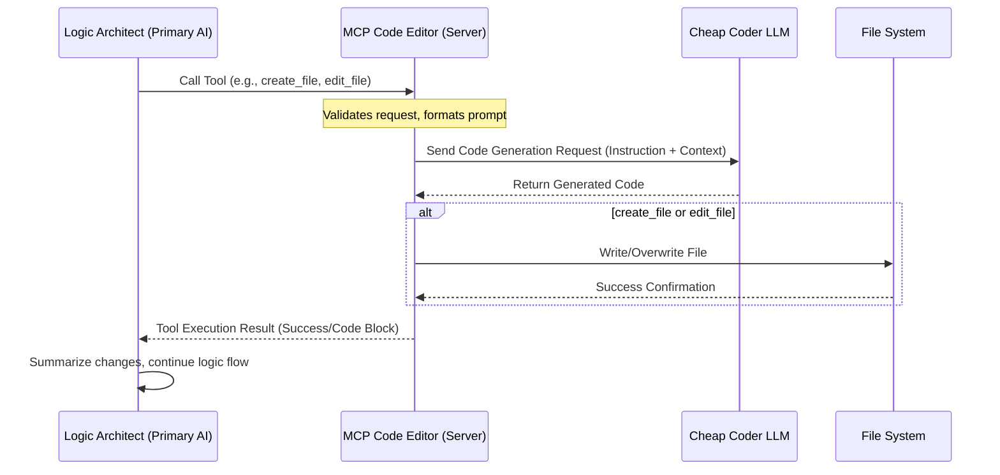

# MCP Code Editor ("The Typist")

[](https://opensource.org/licenses/MIT)
[](https://github.com/yourusername/mcp-code-editor)
[](https://github.com/openai/openai-node)

A custom MCP (Model Context Protocol) Server that acts as a "code writing assistant" to save your primary AI tokens and expenses.

With this setup, your primary AI (such as Claude-3.5-Sonnet or Gemini-1.5-Pro) in Antigravity/Cursor acts purely as a **Logic Architect** that designs program flows and system architectures, while the heavy lifting of writing and editing long files is delegated to a cheaper third-party LLM (such as Gemini-1.5-Flash, Llama-3, or DeepSeek) via MCP Tools.

---

## 🚀 Architecture Overview

The Typist server decouples high-level reasoning from low-level code generation, optimizing cost and speed.



---

## ✨ Core Features

This MCP Server registers 4 essential tools for file manipulation and testing:

1.  **`write_code`**: Generates new code based on logical instructions and returns the code block directly in the chat without writing it to disk (useful for quick review).
2.  **`create_file`**: Generates code based on instructions and writes it directly as a new file at the specified path.
3.  **`edit_file`**: Reads an existing file, sends its contents and edit instructions to the cheap LLM, then overwrites the file completely with the modified code.
4.  **`check_connection`**: Tests connectivity to the configured cheap LLM provider, printing API latency and the raw response to help verify settings.

---

## ⚙️ Installation & Setup

Follow these steps to get your Typist server running locally.

### Option A: Local Execution (For Development/Testing)

#### Step 1: Project Setup

Clone or open this folder in your terminal.

```bash
git clone https://github.com/yourusername/mcp-code-editor.git
cd mcp-code-editor
```

#### Step 2: Install Dependencies

```bash
npm install
```

#### Step 3: Configure Environment Variables

Copy the example file and fill in your API Key and endpoint details.

```bash
cp .env.example .env
```

Edit the newly created `.env` file:

> **Note**: This server uses a standard OpenAI-compatible client, so you can easily point it to OpenRouter, DeepSeek, Groq, or even a local Ollama instance by changing the configuration below.

```env
# .env configuration example
CODER_API_URL=https://api.cometapi.com/v1/chat/completions
CODER_API_KEY=your_api_key_here
CODER_MODEL=gpt-4o-mini
```

### Option B: Global Installation (Recommended for Daily Use)

To run the server from any directory as a global command:

#### Step 1: Install Globally

Navigate to the project directory (if not already there) and run:

```bash
npm install -g .
# OR use npm link if you plan on making local edits
# npm link
```

#### Step 2: Configure Environment Variables

Ensure your `.env` file is configured as described in Option A, Step 3. If running globally, the server will look for a configuration file named **`.mcp-code-editor.env`** in your user's home directory (`~/.mcp-code-editor.env`). Copy the contents of your local `.env` file into this global configuration file for persistent access.

---

## 🔌 Registering to Antigravity / Cursor

You must inform your primary AI environment (Antigravity/Cursor) where to find this server. Add the following configuration to your global MCP configuration file (e.g., `mcp_config.json`):

> ⚠️ **Crucial**: Choose the configuration method that matches your installation option above.

**If using Local Execution (Option A):** Adjust the absolute path to `index.js` based on where the repository is cloned on your system.

```json
{
  "mcpServers": {
    "mcp-code-editor": {
      "command": "node",
      "args": ["/path/to/your/MCP-CodeEditor/index.js"]
    }
  }
}
```

**If using Global Installation (Option B):** Use the package name directly as the command.

```json
{
  "mcpServers": {
    "mcp-code-editor": {
      "command": "mcp-code-editor"
    }
  }
}
```

---

## 🧠 Agent Rules (.clauderules / .cursorrules / gemini.md)

To guide your primary AI to delegate coding tasks effectively, copy the following rules to a `.clauderules` or `.cursorrules` file in the root of the project you are working on:

> These rules enforce the separation of concerns between the Architect and the Coder.

```markdown
# Rule: Logic Architect & Code Writing Delegation

You act as the **Logic Architect**. You have access to the MCP Code Editor tools (`write_code`, `create_file`, `edit_file`).

## Core Rules:

1. **DO NOT Write Long Code Blocks Directly**: Whenever the user asks to create a new file (e.g. React component, Laravel Controller, Python script) or rewrite a long code block (>20 lines), you are **strictly forbidden** from generating it directly in the main chat conversation using your internal resources.
2. **Always Delegate to Tools**:
   - To create a new file, gather detailed logical requirements first, then call the **`create_file`** tool with the full specifications.
   - To modify or add features to an existing file, gather the modification logic, then call the **`edit_file`** tool.
   - To generate temporary code for review in the chat without writing to disk, call the **`write_code`** tool.
3. **Focus on Logic and Structure**: Your primary task in the chat is to think about the architecture, design the program flow, verify the conceptual correctness, and provide extremely specific and detailed instructions for the `instruction` parameter in the tools.
4. **After Tool Execution**: Simply provide a summary of the changes or confirmation that the file was successfully created/updated by the code writing assistant.
```